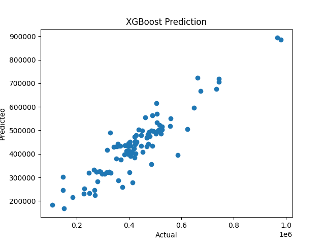
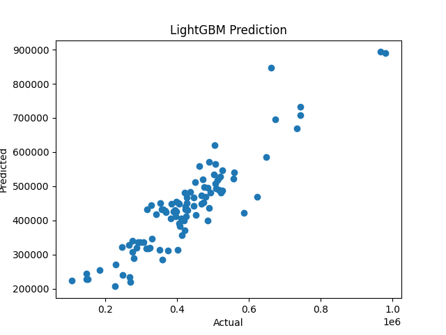

# XGBoost vs LightGBM Demo

A simple regression demo comparing **XGBoost** and **LightGBM** models predicting house prices using the Boston housing dataset.

## 🔧 Features
- Clean, minimal code
- Ready for GitHub portfolio
- Visualizes actual vs predicted values
- Easy to extend

## 🛠️ Requirements

Install dependencies via:
```bash
pip install -r requirements.txt
```

## 🚀 Run

Run either model:
```bash
python xgboost_model.py
python lightgbm_model.py
```

## 📊 Dataset

The dataset (`boston_housing.csv`) contains the following columns:
- **RM**: Average number of rooms per dwelling.
- **LSTAT**: Percentage of lower status of the population (a socioeconomic indicator).
- **PTRATIO**: Pupil-teacher ratio by town.
- **MEDV**: Median value of owner-occupied homes in dollars.

Download from: [boston_housing.csv](https://www.kaggle.com/datasets/schirmerchad/bostonhoustingmlnd/boston_housing.csv)  
Place in `/data` folder as `boston_housing.csv`.

## 📈 Model Performance

Both models predict house prices based on features like the average number of rooms (`RM`), percentage of lower status of the population (`LSTAT`), and pupil-teacher ratio (`PTRATIO`). The target variable (`MEDV`) is in **dollars**, not thousands.

| Model       | RMSE ($)     | R² Score |
|-------------|--------------|----------|
| XGBoost     | $58,893.92   | 0.84     |
| LightGBM    | $59,560.68   | 0.84     |

> 💡 Note: Both models explain approximately **84%** of the variance in house prices, with XGBoost performing slightly better in terms of RMSE.

### Predictions Visualization

#### XGBoost Predictions


#### LightGBM Predictions


> 📈 The scatter plots show how closely the predicted values align with the actual house prices. Points closer to the diagonal line indicate better predictions.

## 🏆 Key Takeaways
- **XGBoost** and **LightGBM** are both powerful gradient boosting frameworks suitable for regression tasks.
- While both models performed similarly, **XGBoost** had a slightly lower RMSE, indicating marginally better accuracy.
- **LightGBM** is generally faster and more memory-efficient, making it ideal for larger datasets.

## 🌟 How to Extend This Project
- **Hyperparameter Tuning**: Use techniques like Grid Search or Random Search to optimize model performance.
- **Feature Engineering**: Add new features or transform existing ones to improve predictive power.
- **Model Saving**: Save trained models for deployment using libraries like `joblib` or `pickle`.
- **Web App**: Create an interactive web interface using tools like Streamlit or Flask to allow users to input data and get predictions.

## 🤝 Contributing
Feel free to fork this repository and contribute improvements or additional features!

## 📄 License
This project is licensed under the MIT License — feel free to use it for personal or commercial projects.

---

## 👨‍💻 Contact
If you have any questions or suggestions, feel free to reach out!

---

### 🎁 Bonus Tip
To make your portfolio stand out:
1. **Add a Jupyter Notebook Version**: Convert your scripts into a Jupyter Notebook for interactive exploration.
2. **Include Feature Importance**: Show which features (`RM`, `LSTAT`, etc.) are most influential in predicting house prices.
3. **Deploy a Web App**: Use Streamlit or Flask to create a simple web app where users can input data and see predictions.

---

